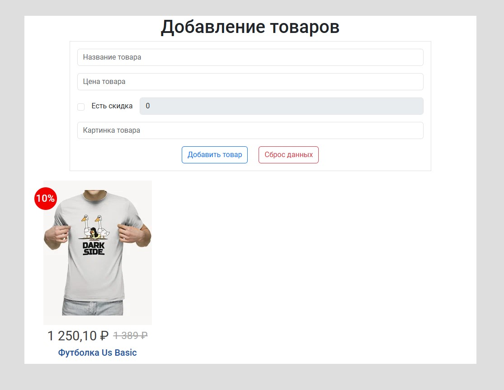
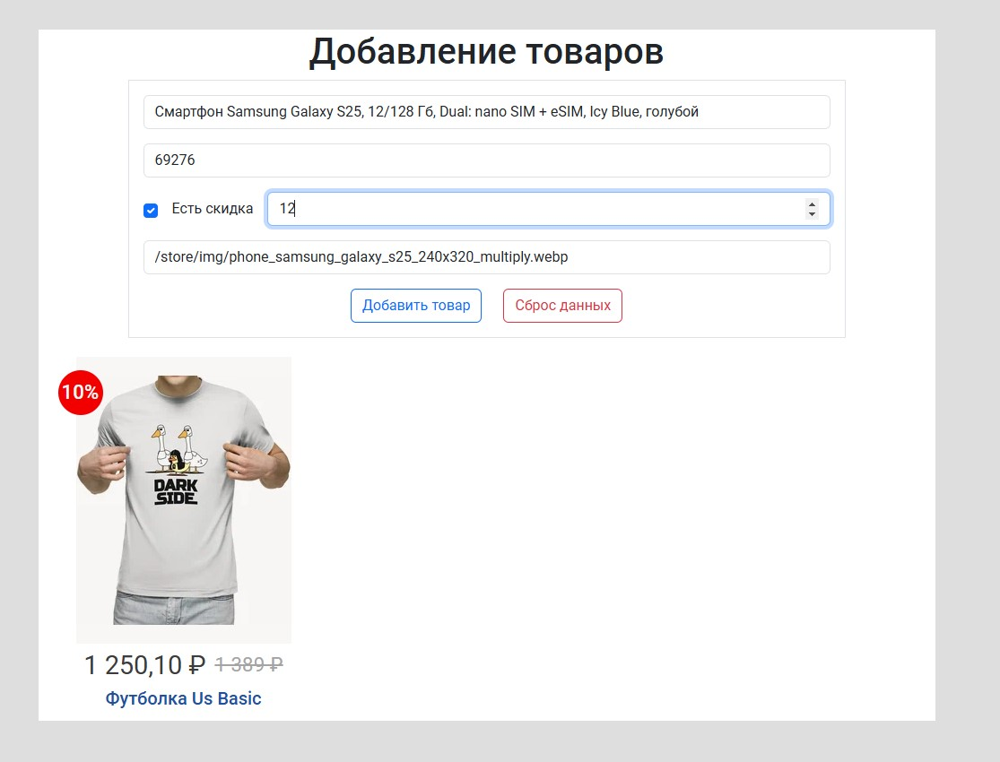
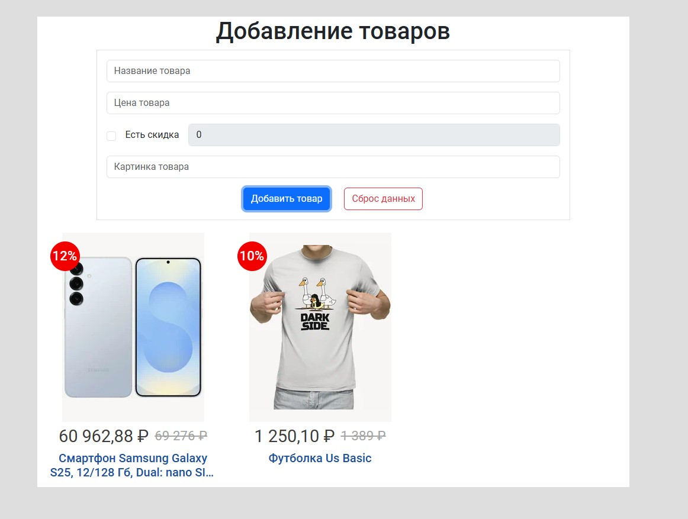
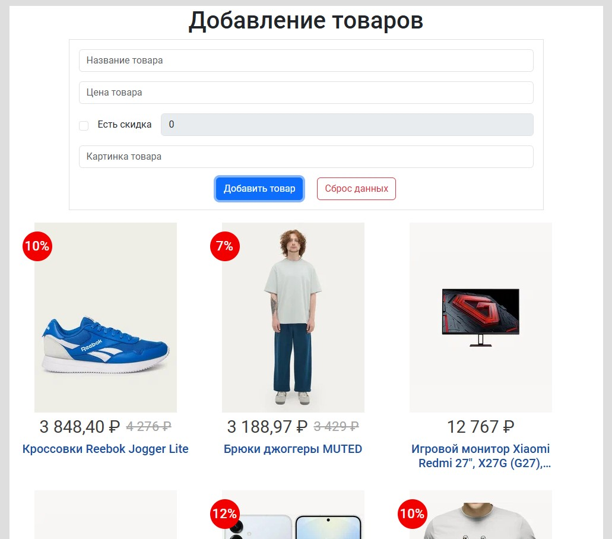

<a name="top"></a>
# Redux - Каталог

[вернуться в корневой readme](../readme.md)


- [Задание](#задание)
- [Решение](#решение)

## Задание

В этой задаче вы выступите в роли аналитика и проектировщика. На базе существующего сервиса вам самостоятельно необходимо спроектировать и реализовать на базе Redux форму добавления и отображения товаров. Важно: нас интересует только добавление и отображение*.

Примечание*: редактирование и удаление делать не нужно.

Задача: разработайте на базе Redux форму добавления и отображения товаров как в Яндекс.Маркете.

Обратите внимание: на базе примера с лекции вы должны сами выступить в роли проектировщика и решить, какие поля и в каком виде — строка, число, boolean — вы будете хранить.

Задача вашего приложения — проектирование формы добавления и реализация списка для отображения:  


[Вверх](#top)

## Решение

Насколько я понял задачу, необходимо было проанализировать состав полей в хранилище Redux.  
Для товара решено хранить объект с полями вида:
```js
{
    id: nanoid(),
    dateCreated: new Date("2024-04-01"),
    name: "Футболка Us Basic",
    image: "/store/img/t_shirt_us_basic_240x320_multiply.webp",
    price: 1389,
    discount: 10,
}
```

Использовано хранилище redux с одним редьюсером и одним действием.

Приложение состоит из формы добавления записи о товаре и компонента вывода карточек товаров по списку.  
Использована стилизация bootstrap. 

### Карточка товара

На карточке отображается картинка товара, цена (при наличии скидки высчитывается итоговая цена), наименование и скидка (при наличии).  
Наименование товара обрезается через CSS, если оно не умещается в две строки, при наведении указателя мыши оно отображается полностью во всплывающей подсказке.  
Для форматирования числа цены с разделителями разрядов и отображением дробной части (при наличии) использован формат интернационализации Intl. 


### Отображение списка товаров

Список сортируется по полю даты создания записи товара в обратном порядке, чтобы самые свежие добавленные товары были в начале списка.  


### Форма ввода информации о товаре

В учебных целях картинки лежат в папке статики public, при создании записи о товарах для отображения картинок товаров используется путь из /store/img относительно папки статики.
Поля формы имеют атрибут required.
Для ввода информации о скидке есть переключатель чекбокс.
У формы есть кнопки отправки информации и очистки формы. После отправки информации форма очищается.


Начальный вид приложения с одной карточкой товара  



Этап ввода информации о товаре в форму добавления товара  


Состояние приложения после отправки информации из формы добавления товара  


Состояние приложения после добавления нескольких товаров  



[Вверх](#top)