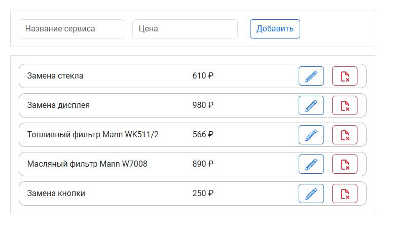
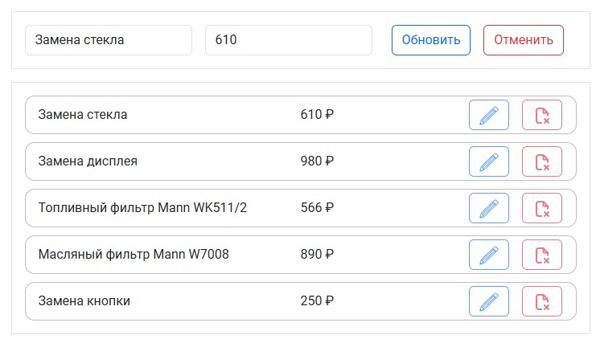
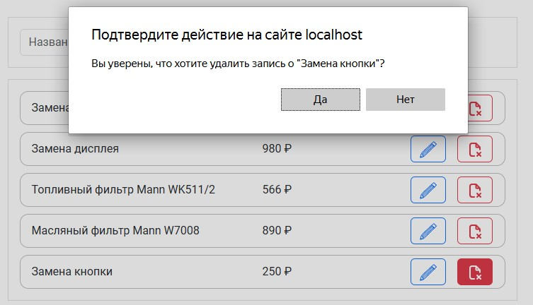
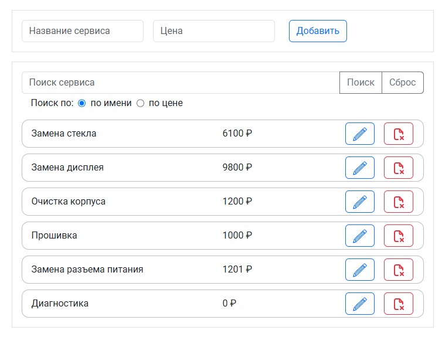
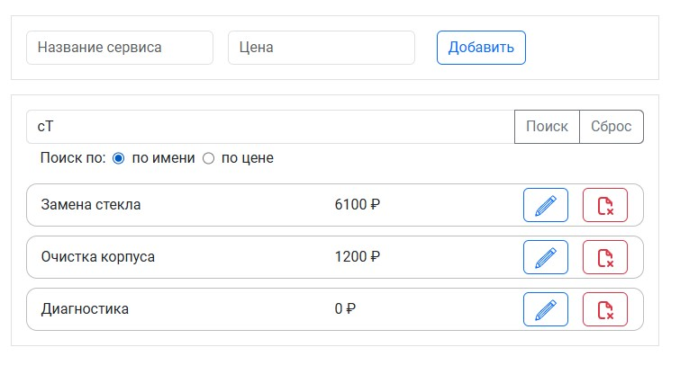
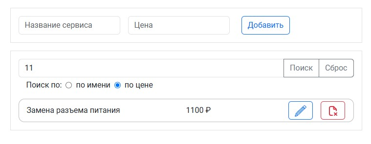

# Redux - Редактирование и фильтрация

[вернуться в корневой readme](../readme.md)

- [Задание](#задание)
- [Решение](#решение)

## Задание

### Редактирование

Этот проект не предполагает взаимодействия по протоколу HTTP и наличия серверной части.  
Взяв за основу проект, рассмотренный на лекции, доработайте его либо напишите с нуля: 
1. По умолчанию показывается форма добавления, при заполнении и нажатии на кнопку Save происходит добавление элемента в список:  

2. При нажатии на кнопку «Редактировать» форма автоматически заполняется данными элемента:  

Далее возможны два сценария:
  1. Если пользователь нажал на кнопку Save, запись в таблице обновляется.
  2. Если пользователь нажал на кнопку Cancel, то поля вычищаются и снова отображается форма добавления.

Бонусное задание: подумайте, как должно вести себя приложение, если вы при редактировании записи, нажмёте на «Удалить» — крестик.

### Фильтрация

Взяв за основу проект редактирования, предложите вариант реализации возможности фильтрации: то есть у вас должно быть строковое поле, при введении данных в которое будут отображаться только объекты, у которых название содержит введённую строку.

Обратите внимание:
- При пустом значении фильтра должны показываться все объекты.
- Неважно, заполнен фильтр или нет, все функции редактирования — добавление, обновление, удаление — должны быть доступны.

[Вверх](#top)

## Решение

Использованы стили библиотеки Bootstrap 

### Функционал редактирования
В store использованы три фрагмента хранилища, описаны действия и редьюсеры для них:
- serviceAdd - для обработки состояния полей формы добавления/изменения данных (подставить значения полей редактируемой записи / очистить форму)
- serviceEdit - для обработки состояния редактирования записи данных, содержит id редактируемой записи и флаг состояния (приложение находится в состоянии редактирования или нет)
- serviceList - для хранения списка записей

Реализовано:
- добавление записи через форму ввода с отображением карточки записи с кнопками редактирования и удаления
- удаление записи
- редактирование записи (можно сохранить изменения или отменить изменения). В режиме редактирования кнопка формы "Добавить" меняется на две кнопки - "Обновить" и "Отменить". Данные записи отображаются в форме для изменения, при этом кнопки редактирования и удаления на карточках записей неактивны.

Скриншот приложения со списком услуг:  

Скриншот приложения в режиме редактирования записи услуги:  

Скриншот приложения в режиме удаления записи услуги:  

### Функционал фильтрации

Состояние фильтра добавлено в редьюсер хранилища услуг. В связи с тем, что объект хранилища усложнился, переработаны действия добавления, редактирования и удаления услуг. 
В компоненте списка данные отображаются с учетом состояния фильтра. 

Фильтрация реализована в компоненте ServiceSearch, поиск происходит по вхождению части строки case-insensitive, через метод includes. Есть возможность поиска по названию услуги и по цене (значение поля преобразовывается при поиске в строку). Для выбора, по какому полю искать, добавлена радиогруппа.

В режиме фильтрации функционал добавления, редактирования и удаления услуги доступен.

Общий вид обновленного приложения  

Результат поиска по имени  

Результат поиска по цене  

[Вверх](#top)